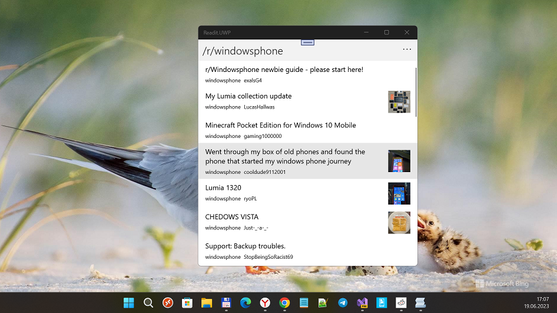
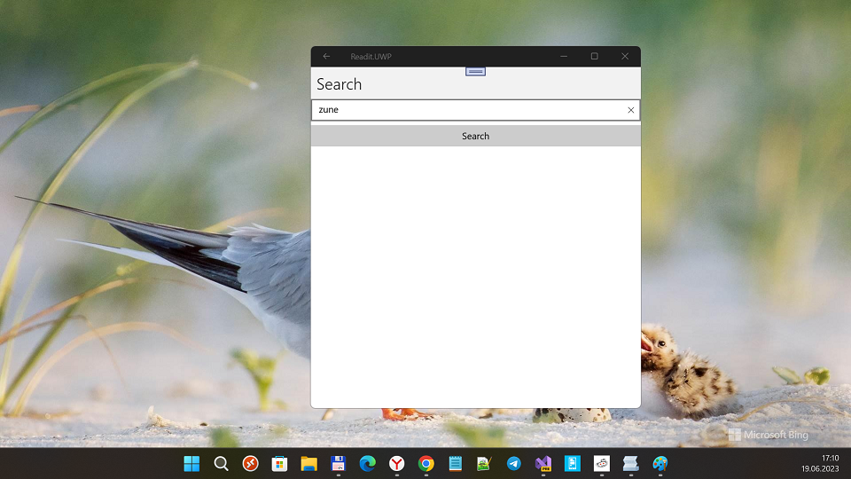
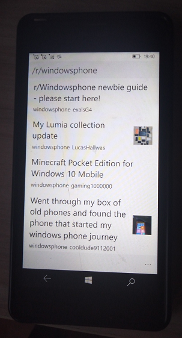

## Readit v1.3.0-alpha
My attempt to assemble lite (minimal) version of famous "Readit" W8.1/W10M app.

I prepared to Reddit API "switch off", hehe :)

## Screenshots

## What's new? 
-  Improved main page ("posts view")
- "Reddit Details mode" (Author's post, Comments)

## Tech. details
- AppType: UWP; Android; iOS
- SDK version (Windows only): 10240 (Astoria compatibility)
- User-Agent: Mozilla/5.0 (Windows NT 10.0) AppleWebKit/537.36 (KHTML, like Gecko) Chrome/114.0.0.0 Safari/537.36

## Few words from the author
"A read-only Reddit client in Xamarin"

## TODO
- Background post topics updates + notifications
- "Favorites" storing, app settings, caching... idk :)

## References
- https://github.com/CometDog/Readit
- https://github.com/CometDog

## ..
As is. No support. DIY

## .
[m][e] Nov, 19 2025

